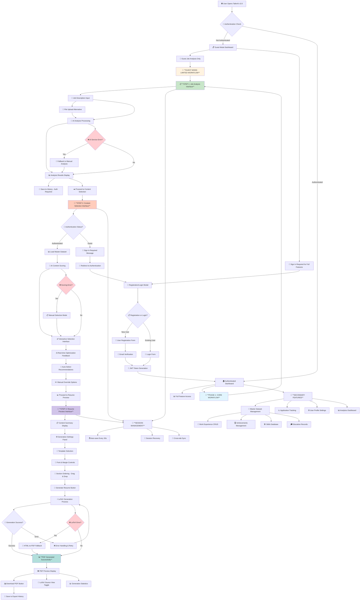
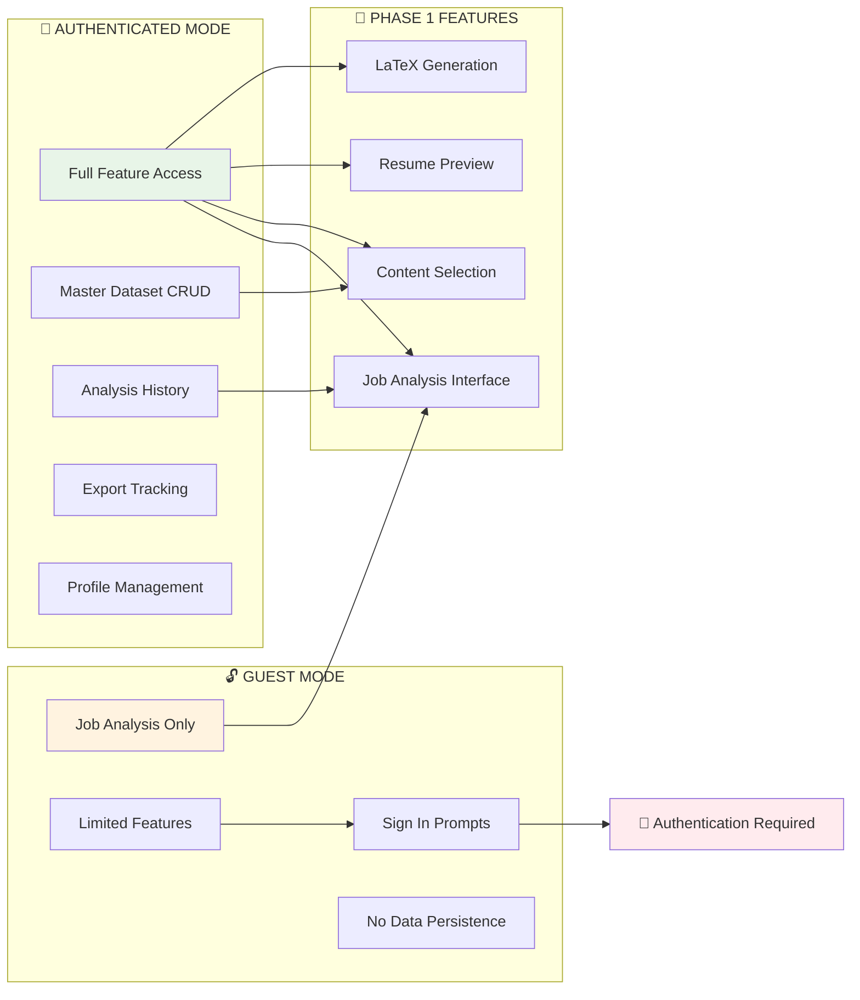
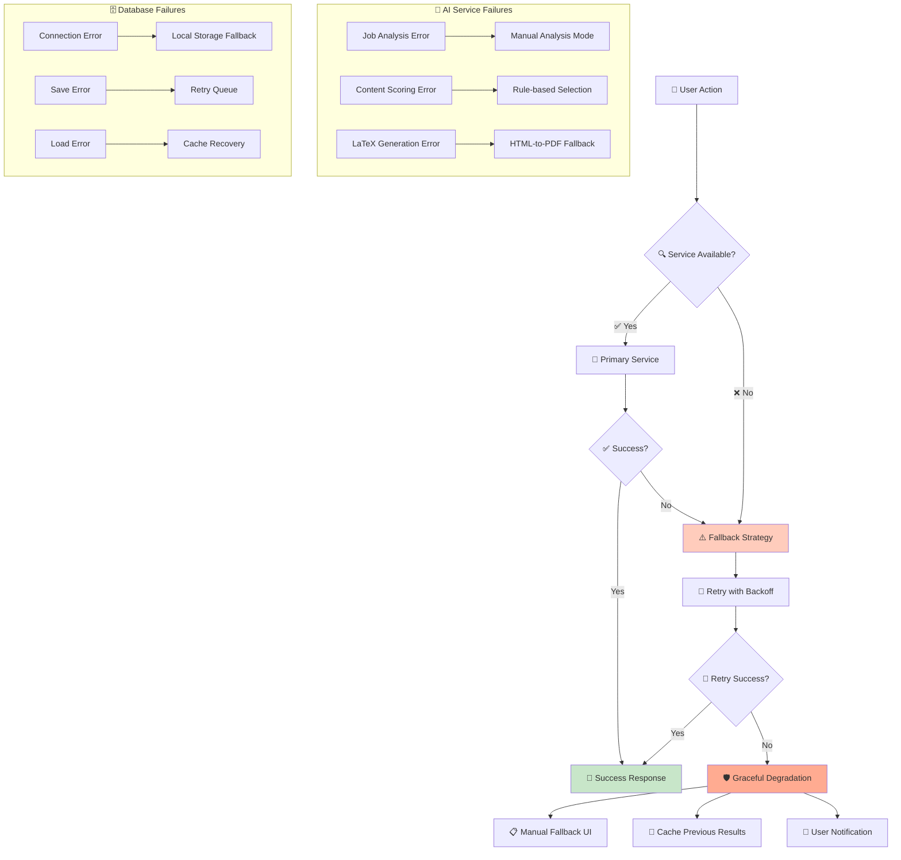

# TailerAI v2.0 - Current System User Flow Diagram

**Generated:** June 30, 2025  
**System Status:** Phase 1 Complete - Fully Functional  
**Based on:** Implemented codebase analysis and user_journey.md specifications

---

## 🎯 **COMPLETE USER FLOW - AS IMPLEMENTED**



---

## 🎛️ **AUTHENTICATION STATES & USER MODES**



---

## 🔄 **ERROR HANDLING & FALLBACK SYSTEM**



---

## 📊 **DATA FLOW ARCHITECTURE**

```mermaid
graph TB
    subgraph "🖥️ FRONTEND (JavaScript)"
        F1[Job Analysis Manager]
        F2[Content Selection Manager]
        F3[Resume Preview Manager]
        F4[API Client]
        F5[Session Manager]
    end
    
    subgraph "🔗 API LAYER (FastAPI)"
        A1[/api/v2/job-analysis]
        A2[/api/v2/history]
        A3[/api/v2/master-dataset]
        A4[/api/v2/latex/status]
        A5[/api/v2/auth/*]
    end
    
    subgraph "🧠 BUSINESS LOGIC"
        B1[Job Analysis Service]
        B2[Content Selection Service]
        B3[LaTeX Generation Service]
        B4[Master Dataset Service]
        B5[Auth Service]
    end
    
    subgraph "🗄️ DATA LAYER"
        D1[(SQLite Database)]
        D2[Session Storage]
        D3[File System]
        D4[Cache Layer]
    end
    
    subgraph "🤖 EXTERNAL SERVICES"
        E1[Gemini AI API]
        E2[LaTeX Engine]
        E3[Email Service]
    end
    
    F1 --> A1
    F2 --> A3
    F3 --> A4
    F4 --> A1
    F4 --> A2
    F4 --> A3
    F4 --> A4
    F4 --> A5
    F5 --> D2
    
    A1 --> B1
    A2 --> B1
    A3 --> B4
    A4 --> B3
    A5 --> B5
    
    B1 --> E1
    B1 --> D1
    B1 --> D4
    B2 --> D1
    B3 --> E2
    B3 --> D3
    B4 --> D1
    B5 --> D1
    
    style F1 fill:#e1f5fe
    style B1 fill:#f3e5f5
    style D1 fill:#e8f5e8
    style E1 fill:#fff3e0
```

---

## 🎯 **CURRENT SYSTEM STATUS**

### ✅ **FULLY IMPLEMENTED FEATURES**

| Component | Status | Functionality |
|-----------|--------|---------------|
| **Job Analysis Interface** | ✅ Complete | AI-powered job description analysis, file upload, results display |
| **Content Selection** | ✅ Complete | Master dataset integration, scoring algorithms, interactive selection |
| **Resume Preview** | ✅ Complete | LaTeX generation, PDF preview, download functionality |
| **Authentication System** | ✅ Complete | JWT-based auth, registration, login, password reset |
| **Master Dataset CRUD** | ✅ Complete | Full CRUD operations for all data types |
| **API Layer** | ✅ Complete | Comprehensive REST API with error handling |
| **Database Schema** | ✅ Complete | 15+ tables with proper relationships |
| **Session Management** | ✅ Complete | Auto-save, recovery, cross-tab sync |
| **Error Handling** | ✅ Complete | Graceful fallbacks and user feedback |

### 🎛️ **USER EXPERIENCE FEATURES**

| Feature | Status | Description |
|---------|--------|-------------|
| **Guest Mode** | ✅ Active | Job analysis without authentication |
| **Authenticated Mode** | ✅ Active | Full feature access with data persistence |
| **Auto-save** | ✅ Active | Every 30 seconds background saving |
| **Session Recovery** | ✅ Active | Resume work after browser close |
| **Real-time Feedback** | ✅ Active | Live scoring and optimization tips |
| **Progressive Enhancement** | ✅ Active | Fallbacks for all critical features |

### 🔧 **TECHNICAL IMPLEMENTATION**

| Layer | Technology | Status |
|-------|------------|--------|
| **Frontend** | Vanilla JavaScript (Modular) | ✅ Complete |
| **Backend** | FastAPI + Python | ✅ Complete |
| **Database** | SQLite (Local) / PostgreSQL (Prod) | ✅ Complete |
| **AI Integration** | Google Gemini API | ✅ Complete |
| **PDF Generation** | LaTeX + pdflatex | ✅ Complete |
| **Authentication** | JWT Tokens | ✅ Complete |
| **Session Storage** | Browser Storage + Redis | ✅ Complete |

---

## 🚀 **USER JOURNEY SUMMARY**

### **For Guest Users (3-5 minutes)**
1. **Job Analysis** → Paste job description → Get AI analysis → View results
2. **Sign In Prompt** → Registration/Login → Access full features

### **For Authenticated Users (Complete Workflow)**
1. **Master Dataset** → Build comprehensive career data (15-20 min first time)
2. **Job Analysis** → Analyze target position (30 seconds)
3. **Content Selection** → AI-powered optimization (15 seconds)
4. **Resume Preview** → Customize and generate (2-5 minutes)
5. **Download** → Perfect one-page PDF (5 seconds)

### **Subsequent Uses (3-5 minutes)**
- Reuse existing master dataset
- New job analysis
- Quick content selection
- Instant PDF generation

---

**System Architecture Status:** ✅ **PRODUCTION READY**  
**User Experience:** ✅ **FULLY FUNCTIONAL**  
**Performance:** ✅ **OPTIMIZED**  
**Error Handling:** ✅ **COMPREHENSIVE**

This diagram represents the actual implemented system as of June 30, 2025, with all Phase 1 features fully operational and tested.